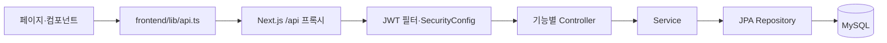

# GongSpec

공기업 취업 준비에 필요한 스펙, 지원 현황, 자기소개서와 일정을 관리하는 웹 애플리케이션입니다. Next.js 프론트엔드와 Spring Boot API를 하나의 저장소에서 관리합니다.

## 현재 기능

- 카카오 로그인, HttpOnly JWT 쿠키 인증, 사이트 닉네임 설정
- 자격증·학교교육·직업교육·경력·프로젝트·지원 현황·자기소개서·메모·사이트 관리
- 자료 검색, 고정, 접기, 드래그·키보드 순서 변경
- 개인 일정과 지원 전형 날짜를 합친 월별 캘린더, 연속 일정, 한국 공휴일, D-day
- 캘린더 `+1`에서 숨겨진 일정 바로 열기, `+2` 이상에서 목록 선택
- 지원별 준비 체크리스트 추가·수정·완료 체크·삭제, 지원 카드의 완료 개수 표시
- 공고별 자기소개서 문항 관리, 글자 수 표시, 문항 본문 복사
- ALIO 채용공고 검색, 고용형태·기관유형 필터, 공고에서 지원 현황 입력 시작
- 스터디 모집글·댓글·신고, 모집 마감/재개, 관리자의 신고 조회·숨김 처리
- 라이트/다크 테마, 사이드바 열림 상태 저장

## 기술 구성

| 구분 | 현재 구성 | 기준 파일 |
|---|---|---|
| 프론트엔드 | Next.js 16.3.3, React 19, TypeScript, Tailwind CSS 4 | [frontend/package.json](frontend/package.json) |
| 데이터 조회 | SWR, 공통 Fetch 래퍼 | [frontend/lib/api.ts](frontend/lib/api.ts) |
| 백엔드 | Java 21, Spring Boot 3.5.6, Spring MVC, Spring Security, Spring Data JPA | [backend/pom.xml](backend/pom.xml) |
| API 문서 | springdoc-openapi 2.8.17, Swagger UI | [OpenApiConfig.java](backend/src/main/java/com/gongspec/common/config/OpenApiConfig.java) |
| 데이터베이스 | 기본 실행·배포는 MySQL 8.4, 자동 테스트는 H2 메모리 DB | [application.yml](backend/src/main/resources/application.yml), [테스트 설정](backend/src/test/resources/application.yml) |
| 테스트 | Vitest·Testing Library, JUnit 5·Spring Boot Test·MockMvc | [vitest.config.mts](frontend/vitest.config.mts), `backend/src/test/` |
| 빌드·배포 | pnpm 9.15.9, Maven, Docker Compose, GitHub Actions | Dockerfile 및 `.github/workflows/` |

## 저장소 구조

```text
gongspec/
├── README.md                       # 프로젝트 구조와 개발·검증 안내
├── .env.example                    # 로컬·배포 환경변수 예시
├── docker-compose.yml              # MySQL + API + 프론트 전체 스택
├── .github/workflows/
│   ├── ci.yml                      # 백엔드 테스트·패키징, 프론트 검사·빌드
│   └── deploy-macmini.yml           # CI 성공 후 검증한 커밋을 맥 미니에 배포
├── docs/
│   └── mac-mini-deploy.md           # 맥 미니·Cloudflare Tunnel 운영 안내
├── backend/
│   ├── pom.xml                     # Java 의존성·빌드 설정
│   ├── Dockerfile                  # Maven 빌드 → JRE 실행 이미지
│   ├── docker-compose.yml          # 로컬 개발용 MySQL만 실행
│   └── src/
│       ├── main/java/com/gongspec/  # API 애플리케이션 코드
│       ├── main/resources/         # 기본 설정과 환경변수 로더 등록
│       ├── test/java/com/gongspec/  # API·서비스·변환·설정 회귀 테스트
│       └── test/resources/         # 테스트 전용 H2·인증·동기화 설정
└── frontend/
    ├── app/                        # URL별 페이지와 전역 스타일
    ├── components/                 # 기능별 화면·입력·모달 컴포넌트
    ├── hooks/                      # 인증·검색 지연·테마·공휴일 등의 훅
    ├── lib/                        # API 타입·호출, 데이터 변환과 계산
    ├── public/                     # 아이콘·이미지 등 정적 파일
    ├── scripts/mock-api.mjs        # 일부 API의 메모리 기반 개발용 모의 서버
    ├── next.config.mjs             # API 프록시와 standalone 출력 설정
    ├── vitest.config.mts           # 테스트 탐색 범위·경로 별칭
    ├── package.json                # 프론트 명령과 의존성
    ├── pnpm-lock.yaml              # 고정된 의존성 해석 결과
    └── Dockerfile                  # 의존성 설치 → 빌드 → standalone 실행
```

`node_modules/`, `.next/`, `backend/target/`는 설치·빌드로 생성되는 결과물입니다. `backend/.tools/`는 선택적으로 내려받은 로컬 Maven 도구 위치이며 소스 디렉터리가 아닙니다.

## 프론트엔드 상세

### 페이지와 상태

| 경로 | 역할 |
|---|---|
| [app/layout.tsx](frontend/app/layout.tsx) | 공통 HTML, 메타데이터, 전역 CSS, 프로덕션 분석 컴포넌트 |
| [app/page.tsx](frontend/app/page.tsx) | 메인 탭 전환, 조회 데이터, 자료 저장, 모달과 캘린더 선택의 연결 |
| [app/auth/kakao/callback/page.tsx](frontend/app/auth/kakao/callback/page.tsx) | 카카오 인가 코드·state를 API로 보내고 홈 또는 닉네임 화면으로 이동 |
| [app/nickname/page.tsx](frontend/app/nickname/page.tsx) | 로그인 사용자의 사이트 닉네임 설정 |
| [app/admin/page.tsx](frontend/app/admin/page.tsx) | 신고 목록과 글·댓글 숨김/해제 |
| [app/globals.css](frontend/app/globals.css) | 공통 색상, 테마, 화면별 스타일, 반응형 레이아웃 |

메인 화면의 캘린더·지원 현황·자기소개서 등은 `app/page.tsx`의 탭 상태로 전환합니다. 각 탭이 별도 Next.js URL을 갖는 구조는 아닙니다. 서버 데이터는 SWR로 조회하고, 입력 초안과 모달 상태는 React 상태로 관리합니다.

### 컴포넌트

| 묶음 | 주요 파일 | 담당 화면 |
|---|---|---|
| 자료 | `resource-card.tsx`, `resource-form.tsx` | 자료 카드, 자료 유형별 입력·수정 |
| 지원 준비 | `application-checklist.tsx` | 지원 폼 안의 준비 항목 편집 |
| 캘린더 | `calendar-board.tsx`, `dday-card.tsx`, `schedule-modal.tsx` | 월별 배치, 임박 일정, 개인 일정 편집 |
| 날짜 입력 | `date-range-picker.tsx`, `period-field.tsx` | 단일 날짜·기간 선택, 교육·경력 기간 입력 |
| 자기소개서 | `essay-board.tsx`, `essay-copy-button.tsx` | 공고별 문항, 본문 복사와 결과 표시 |
| 채용공고 | `recruit-board.tsx`, `hire-filters.tsx`, `inst-type-filters.tsx` | 공고 목록과 필터 |
| 스터디 | `study-board.tsx` | 모집글 목록·편집·상세, 댓글, 신고 폼 |
| 공통 UI | `modal-shell.tsx`, `confirm-dialog.tsx`, `combo-field.tsx`, `sortable-list.tsx` | 모달, 확인창, 선택 입력, 순서 변경 |
| 화면 틀 | `sidebar-toggle.tsx`, `login-gate.tsx`, `app-notice.tsx`, `ui/button.tsx` | 사이드바, 로그인 안내, 알림, 버튼 |

### 훅과 데이터 변환

- `hooks/use-auth.ts`: 로그인 상태 조회와 로그인·로그아웃. 401은 비로그인 상태로 처리합니다.
- `hooks/use-debounce.ts`: 입력 후 지연된 검색값을 제공합니다.
- `hooks/use-theme.ts`, `use-sidebar-open.ts`: 브라우저에 저장한 테마와 사이드바 상태를 복원합니다.
- `hooks/use-korean-holidays.ts`: 연도별 공휴일 응답을 캐시합니다.
- `lib/api.ts`: 백엔드 요청·응답 타입, 인증 쿠키 전송, 타임아웃, 오류 처리, SWR 캐시 키를 정의합니다.
- `lib/resource-fields.ts`: 자료별 입력 필드, 초기값, 저장 payload, 지원 전형 병합, 자기소개서 문항 변환을 정의합니다.
- `lib/calendar-events.ts`: 개인 일정과 지원 현황의 전형 날짜를 캘린더 이벤트로 변환합니다.
- `lib/calendar-layout.ts`: 이벤트를 주별·행별로 배치하고 날짜별 숨김 목록을 계산합니다.
- `lib/dates.ts`, `korean-holidays.ts`: 날짜 범위·D-day·만료일 계산과 공휴일 변환을 담당합니다.
- `lib/application-checklist.ts`: 체크리스트 JSON을 읽고 저장할 때 빈 항목을 정리합니다.
- `lib/recruits.ts`: 채용공고 표시값과 지원 현황의 입력 초안을 만듭니다.
- `lib/certificates.ts`, `tabs.tsx`, `reorder.ts`, `utils.ts`: 자격증 선택값, 메뉴 정의, 배열 순서 변경, CSS 클래스 결합을 담당합니다.

## 백엔드 상세

기준 패키지는 `backend/src/main/java/com/gongspec/`이며, [GongspecApplication.java](backend/src/main/java/com/gongspec/GongspecApplication.java)가 진입점입니다. JPA 감사 시각 기록, 설정 바인딩, 스케줄러를 활성화합니다.

| 패키지 | 주요 하위 디렉터리 | 역할 |
|---|---|---|
| `auth` | `config`, `controller`, `dto`, `jwt`, `service` | 카카오 OAuth, 로그인 쿠키, JWT 발급·검증, 현재 사용자 식별 |
| `user` | `controller`, `dto`, `entity`, `repository`, `service`, `support` | 사용자 프로필, 사이트 닉네임, 관리자 여부 |
| `resource` | `controller`, `dto`, `entity`, `service`, `support` | 자료 공통 API, 유형별 저장소 선택, 소유권 확인, 정렬·상세정보 변환 |
| `certificate` | `entity`, `repository` | 자격증·어학시험 자료 저장 |
| `education` | `entity`, `repository` | 학교교육의 과목·학점·성적·기간·내용 저장 |
| `training` | `entity`, `repository` | 직업교육의 기관·NCS·교육시간 등 저장 |
| `career` | `entity`, `repository` | 근무기관·고용형태·기간·담당업무 저장 |
| `project` | `entity`, `repository` | 프로젝트 역할·수행내용·성과 등 저장 |
| `application` | `entity`, `repository` | 회사·공고와 서류·필기·면접 전형 정보 저장. API의 tab 값은 `applications` |
| `essay` | `entity`, `repository` | 공고별 자기소개서 문항 JSON과 기존 단일 문항 필드 저장 |
| `memo`, `site` | `entity`, `repository` | 메모 본문과 참고 사이트 URL·설명 저장 |
| `schedule` | `controller`, `dto`, `entity`, `repository`, `service` | 사용자가 직접 등록한 개인 일정 CRUD |
| `recruit` | `client`, `config`, `controller`, `dto`, `entity`, `repository`, `scheduler`, `service`, `support` | ALIO 통신, 공고 저장·검색·동기화, 기관·고용형태 분류 |
| `study` | `controller`, `dto`, `entity`, `repository`, `service` | 모집글·댓글·신고, 작성자 권한과 관리자 숨김 처리 |
| `admin` | `controller` | 관리자 신고 조회와 숨김/해제 API 진입점 |
| `common` | `config`, `controller`, `convert`, `dto`, `entity`, `exception`, `support` | 보안·CORS·환경 설정, 헬스체크, JSON 변환, 공통 시각, 오류·입력 검사 |

### 데이터 저장과 요청 흐름



- `BaseEntity`는 UUID와 생성·수정 시각을 제공합니다.
- `ResourceItem`은 자료의 소유자·제목·태그·정렬·상세정보 변환을 정의하는 `@MappedSuperclass`입니다. 별도 공통 자료 테이블이 생기는 것이 아니라 공통 컬럼이 각 자료 테이블에 포함됩니다.
- 자료 테이블은 `certificates`, `educations`, `trainings`, `careers`, `projects`, `applications`, `essays`, `memos`, `sites`입니다.
- 자료 API의 `details`는 문자열 맵입니다. 각 엔티티의 `specificKeys`·`applySpecific`·`exportSpecific`가 전용 컬럼과의 변환을 담당하고 나머지 키는 `extras`의 JSON 문자열로 저장됩니다.
- 체크리스트는 `details.checklist`의 JSON 문자열로 저장되며 지원 폼을 저장해야 반영됩니다. 자기소개서 문항 목록은 `details.entries`로 전달됩니다.
- 자료 수정 시 `null` 공통 필드는 유지합니다. `details`가 전달되면 상세정보는 교체되므로, 프론트가 다른 전형이나 기존 항목을 보존할 내용을 합쳐서 전송합니다.
- 지원 전형의 캘린더 일정은 프론트에서 지원 날짜로부터 계산합니다. 개인 일정 테이블 `schedules`에 전형별 일정을 복제 저장하지 않습니다.
- 사용자 데이터는 요청에서 보낸 사용자 ID 대신 인증 정보의 UUID로 조회합니다. 스터디는 개인 자료와 별도로 로그인 사용자 간 공유되며 수정·삭제에 작성자 권한을 확인합니다.

설정은 [application.yml](backend/src/main/resources/application.yml)에 있습니다. Hibernate `ddl-auto: update`를 사용하며, `WidenResourceTextColumns`는 기존 MySQL의 일부 텍스트 컬럼 폭을 점검·확장합니다. 별도 Flyway/Liquibase 마이그레이션 디렉터리는 없습니다.

### 주요 API

| 경로 | 용도 | 접근 조건 |
|---|---|---|
| `GET /api/health` | 서버 기동 확인 | 공개 |
| `GET /api/auth/kakao/url`, `POST /api/auth/kakao/callback` | 로그인 시작·콜백 | 공개, 콜백에서 OAuth state 검증 |
| `GET /api/auth/me`, `POST /api/auth/logout` | 현재 사용자·로그아웃 | 내 정보는 로그인 필요, 로그아웃은 공개 |
| `PUT /api/users/me/nickname` | 사이트 닉네임 변경 | 로그인 |
| `/api/resources`, `/api/resources/{id}`, `PUT /api/resources/order` | 자료 목록·CRUD·순서 변경 | 로그인, 사용자 소유 자료 |
| `/api/schedules`, `/api/schedules/{id}` | 개인 일정 CRUD | 로그인, 사용자 소유 일정 |
| `GET /api/recruits` | 진행 중 공고 검색 | 공개 |
| `POST /api/recruits/sync` | ALIO 수동 동기화 | 로그인, 서버에 ALIO 키 필요 |
| `/api/study/posts`, `/api/study/comments/...` | 모집글·댓글·신고·모집 상태 변경 | 로그인, 작성 등 일부 동작은 닉네임 필요 |
| `/api/admin/reports`, `/api/admin/posts/...`, `/api/admin/comments/...` | 신고 조회·숨김/해제 | 서버에서 관리자 여부 확인 |

ALIO 정기 동기화의 기본 시각은 서울 시간 매일 08:10, 16:10입니다. 인증키가 없거나 동기화 설정이 꺼져 있으면 스케줄 실행을 건너뜁니다. 공휴일은 백엔드 ALIO 경로가 아니라 Next.js의 `/holiday-api/:year` 프록시를 통해 Nager.Date에서 조회합니다.

## Swagger UI / OpenAPI

서버를 실행하면 컨트롤러와 요청·응답 DTO에서 API 문서를 자동 생성합니다. 각 기능은 한글 태그로 묶이며, API별 요약과 인증 필요 여부를 표시합니다. Spring Boot 3.5 계열과의 호환성을 고려해 [springdoc 공식 호환성 표](https://springdoc.org/v2/#what-is-the-compatibility-matrix-of-springdoc-openapi-with-spring-boot)의 2.8 계열을 사용합니다.

| 실행 방식 | Swagger UI | OpenAPI JSON |
|---|---|---|
| 백엔드 직접 실행 | `http://localhost:8080/swagger-ui.html` | `http://localhost:8080/v3/api-docs` |
| 프론트 프록시 / Docker 전체 스택 | `http://localhost:13001/swagger-ui.html` | `http://localhost:13001/v3/api-docs` |
| HTTPS 배포 | `https://<프론트 도메인>/swagger-ui.html` | `https://<프론트 도메인>/v3/api-docs` |

문서 경로는 로그인 없이 열 수 있습니다. 실제 개인 자료 API의 로그인·소유권 검사와 관리자 API의 권한 검사는 그대로 적용됩니다.

API를 실행하려면:

1. 브라우저에서 사이트에 카카오 로그인한 뒤 **같은 사이트 주소**의 Swagger UI를 엽니다. 로그인 쿠키를 브라우저가 전송하므로 HttpOnly 쿠키 값을 직접 입력할 필요가 없습니다. 예를 들어 `localhost`에서 로그인했다면 Swagger도 `localhost`로 접속합니다.
2. 별도로 발급받은 GongSpec JWT를 사용할 때는 **Authorize → bearerAuth**에 `Bearer ` 접두어 없이 토큰만 입력합니다. 카카오 액세스 토큰은 사용할 수 없습니다.
3. 사용할 API를 펼치고 **Try it out → Execute**를 누릅니다. 변경 API는 로그인한 사용자의 실제 데이터에 적용됩니다.

`cookieAuth`는 기존 로그인 쿠키 인증을 설명하기 위한 정의입니다. Swagger 입력창에서 HttpOnly 쿠키를 설정하는 방식은 지원하지 않습니다. 관리자 API는 관리자 계정으로 로그인하거나 해당 계정의 JWT를 사용해야 합니다.

설정 위치:

- `common/config/OpenApiConfig.java`: 문서 제목, 상대 서버 주소(`/`), Bearer·쿠키 인증 정의
- 각 Controller의 `@Tag`, `@Operation`, `@SecurityRequirement`: 기능 분류·요약·인증 표시
- `application.yml`의 `springdoc`: 문서 대상과 Swagger UI 문서 경로
- `SecurityConfig.java`: 문서와 UI 정적 파일의 공개 접근
- `frontend/next.config.mjs`: `/swagger-ui.html`, `/swagger-ui/**`, `/v3/api-docs/**`, `/v3/api-docs.yaml`의 백엔드 전달

문서의 서버 주소는 상대 경로이므로 Docker 내부의 `backend:8080` 대신 사용자가 접속한 프론트 주소로 API를 호출합니다. 프록시 설정이 바뀐 경우 프론트도 재시작하거나 이미지를 다시 빌드해야 합니다.

## 개발 환경 준비

- Java 21, Maven 3.9 계열
- Node.js 22, pnpm 9.15.9 (CI·Docker 기준)
- MySQL 8.4 또는 Docker Compose
- 실제 로그인용 카카오 앱 설정, 공고 동기화용 ALIO 인증키

저장소 루트에서 `.env.example`을 복사하고 필요한 값을 입력합니다.

```bash
cp .env.example .env
```

| 환경변수 | 용도 |
|---|---|
| `KAKAO_CLIENT_ID`, `KAKAO_CLIENT_SECRET` | 카카오 REST API 키와 앱 비밀키 |
| `KAKAO_REDIRECT_URI` | 로컬 기본 콜백: `http://localhost:13001/auth/kakao/callback` |
| `MYSQL_URL`, `MYSQL_USER`, `MYSQL_PASSWORD` | 직접 실행하는 백엔드의 MySQL 연결 정보 |
| `MYSQL_ROOT_PASSWORD` | Compose MySQL 초기화용 root 비밀번호 |
| `JWT_SECRET`, `JWT_EXPIRE` | JWT 서명키와 유효기간 |
| `CORS_ORIGINS`, `COOKIE_SECURE` | 허용 프론트 주소와 HTTPS 쿠키 설정 |
| `ALIO_SERVICE_KEY` | 서버의 공고 동기화 인증키 |
| `APP_ADMIN_KAKAO_IDS` | 쉼표로 구분한 관리자 카카오 회원번호 |
| `API_BASE_URL` | Next.js 프록시가 연결할 백엔드 주소. 프론트 실행/빌드 시 지정 |
| `NEXT_PUBLIC_API_BASE_URL` | 프론트 공통 HTTP 래퍼의 직접 API 주소. 기본값은 동일 출처 `/api`이므로 일반적인 Compose 구성에서는 지정하지 않음 |

백엔드 환경변수 로더는 실행 디렉터리와 그 상위의 `.env`를 찾아 읽습니다. 실제 프로세스 환경변수가 우선합니다. 프론트는 루트 `.env`를 이 로더로 읽지 않으므로 아래 예시처럼 `API_BASE_URL`을 명령에 지정합니다. 카카오 콘솔의 Redirect URI도 같은 주소로 설정해야 합니다.

## 로컬 실행

### 1. MySQL 실행

저장소 루트에서 실행합니다. 이 Compose 파일은 MySQL만 호스트 `3306`에 엽니다.

```bash
docker compose -f backend/docker-compose.yml up -d
```

### 2. 백엔드 실행

새 터미널에서 실행합니다. Java 21이 선택되어 있는지 `java -version`으로 확인합니다.

```bash
cd backend
mvn spring-boot:run
```

Maven을 `backend/.tools/apache-maven-3.9.11`에 별도로 설치했다면 `mvn` 대신 `./.tools/apache-maven-3.9.11/bin/mvn`을 사용할 수 있습니다. `.tools/`는 저장소에 포함되지 않습니다.

현재 기본 설정은 MySQL입니다. `SPRING_PROFILES_ACTIVE=local`만 지정해서 H2로 전환하는 별도 프로필 설정은 없습니다. 자동 테스트는 `src/test/resources/application.yml`의 H2 메모리 DB를 사용합니다.

### 3. 프론트엔드 실행

또 다른 터미널에서 실행합니다.

```bash
cd frontend
pnpm install --frozen-lockfile
API_BASE_URL=http://127.0.0.1:8080 pnpm dev --port 13001
```

| 직접 실행 서비스 | 주소 |
|---|---|
| 프론트 | `http://localhost:13001` |
| 백엔드 | `http://localhost:8080` |
| MySQL | `localhost:3306` |

`frontend/scripts/mock-api.mjs`는 기본 인증·자료·일정 UI 확인용 보조 서버입니다. `pnpm mock-api`로 실행할 수 있지만 메모리 저장 방식이며 실제 백엔드의 채용공고·스터디·관리자 기능 전체를 대체하지 않습니다.

## Docker 전체 스택 실행·배포

루트 `.env`를 준비한 다음 저장소 루트에서 실행합니다.

```bash
docker compose up -d --build
```

| 서비스 | 컨테이너 내부 주소 | 호스트 노출 |
|---|---|---|
| 프론트 | `frontend:3000` | `http://localhost:13001` |
| 백엔드 | `backend:8080` | 없음. 프론트 `/api` 프록시로 접근 |
| MySQL | `mysql:3306` | 없음. Compose 네트워크 내부에서 접근 |

루트 Compose는 MySQL 정상 상태를 확인한 뒤 백엔드를, 백엔드 정상 상태를 확인한 뒤 프론트를 시작합니다. 데이터는 `gongspec-mysql` 볼륨에 저장합니다. `backend/docker-compose.yml`은 MySQL만 노출하는 개발 구성이고 루트 파일은 전체 서비스 구성입니다.

프론트 이미지는 빌드 시 `API_BASE_URL=http://backend:8080`을 전달하고 Next.js standalone 출력으로 실행합니다. 백엔드는 Maven으로 JAR를 만든 뒤 JRE 이미지에서 실행합니다. 백엔드 Docker 빌드 자체는 테스트를 생략하므로 CI 또는 로컬 `mvn verify`로 먼저 검증합니다.

공개 HTTPS 배포에서는 `KAKAO_REDIRECT_URI`, `CORS_ORIGINS`를 실제 프론트 주소로 맞추고 `COOKIE_SECURE=true`, 별도의 `JWT_SECRET`을 사용합니다. 맥 미니와 Cloudflare Tunnel 운영 절차는 [docs/mac-mini-deploy.md](docs/mac-mini-deploy.md)를 참고하세요.

## 테스트와 변경 확인

```bash
# 저장소 루트에서 백엔드 전체 테스트·패키징
cd backend
mvn --batch-mode --no-transfer-progress verify

# 프론트 타입 검사·전체 테스트·프로덕션 빌드
cd ../frontend
pnpm install --frozen-lockfile
pnpm typecheck
pnpm test
pnpm build
```

- 백엔드 테스트는 `backend/src/test/java/com/gongspec/` 아래 기능별 패키지에 있습니다. H2와 테스트 인증 설정을 사용하며 실제 카카오·ALIO 인증키는 필요하지 않습니다.
- 프론트 테스트는 검증할 코드 옆의 `*.test.ts`, `*.test.tsx`에 있습니다. 계산·변환은 Node 환경, 화면 상호작용은 파일에 지정한 jsdom 환경에서 확인합니다.
- `pnpm typecheck`는 Next.js 경로 타입을 생성한 뒤 TypeScript를 검사합니다. `next-env.d.ts` 등 생성 파일의 변경은 기능 변경과 구분해서 확인합니다.
- 특정 테스트만 실행하려면 `pnpm test -- components/calendar-board.test.tsx`처럼 파일 경로를 지정할 수 있습니다.

| 변경 내용 | 먼저 볼 파일과 검증 대상 |
|---|---|
| 자료 입력 필드 | `resource-fields.ts`, `resource-form.tsx`, 해당 엔티티, 자료 API 테스트 |
| 지원 체크리스트 | `application-checklist.ts`, `application-checklist.tsx`, 자료 폼·병합 테스트 |
| 캘린더 배치·선택 | `calendar-events.ts`, `calendar-layout.ts`, `calendar-board.tsx`와 인접 테스트 |
| 로그인·권한 | `auth/`, `SecurityConfig`, `use-auth.ts`, 콜백 페이지, 인증·접근 차단 테스트 |
| 공고 수집·분류 | `recruit/`, `recruits.ts`, 클라이언트·서비스·분류 테스트 |
| 스터디·관리자 | `study/`, `admin/`, `study-board.tsx`, 스터디·관리자 API 테스트 |

## GitHub CI와 배포

[ci.yml](.github/workflows/ci.yml)은 PR과 `main` 이외 브랜치 push에서 실행합니다.

- `Backend JUnit`: Java 21에서 `mvn --batch-mode --no-transfer-progress verify`
- `Frontend checks`: Node.js 22·pnpm 9.15.9로 고정 의존성 설치 후 타입 검사·테스트·빌드
- JUnit 결과는 성공 여부와 관계없이 `backend-junit-reports` 아티팩트로 14일 보관

`main` push와 수동 배포는 [deploy-macmini.yml](.github/workflows/deploy-macmini.yml)이 동일한 CI를 호출합니다. 두 검증이 모두 성공하면 `self-hosted`, `macOS`, `gongspec` 라벨의 러너에서 **검증한 커밋**을 체크아웃하고 Compose를 재빌드합니다. 이후 내부 API, 로컬 프론트, 공개 주소의 응답을 확인합니다. 수동 배포도 `main`에서만 수행합니다.

PR 병합 시 검사를 강제하려면 GitHub 브랜치 보호 규칙 또는 Ruleset에서 `Backend JUnit`, `Frontend checks`를 필수 검사로 지정해야 합니다. 워크플로 파일만으로 병합 보호 규칙까지 설정되지는 않습니다.
